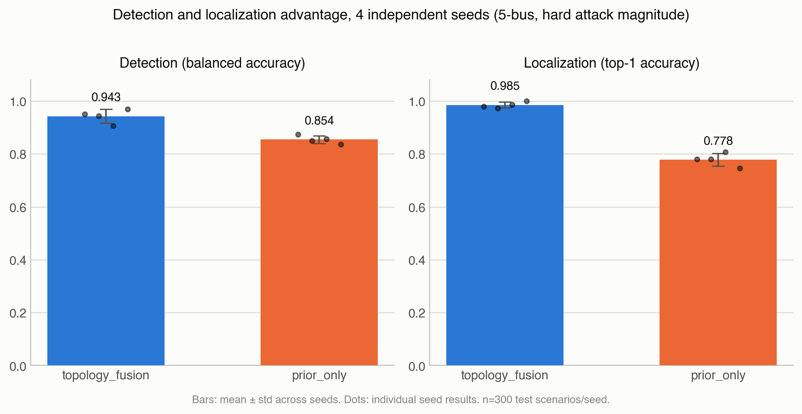
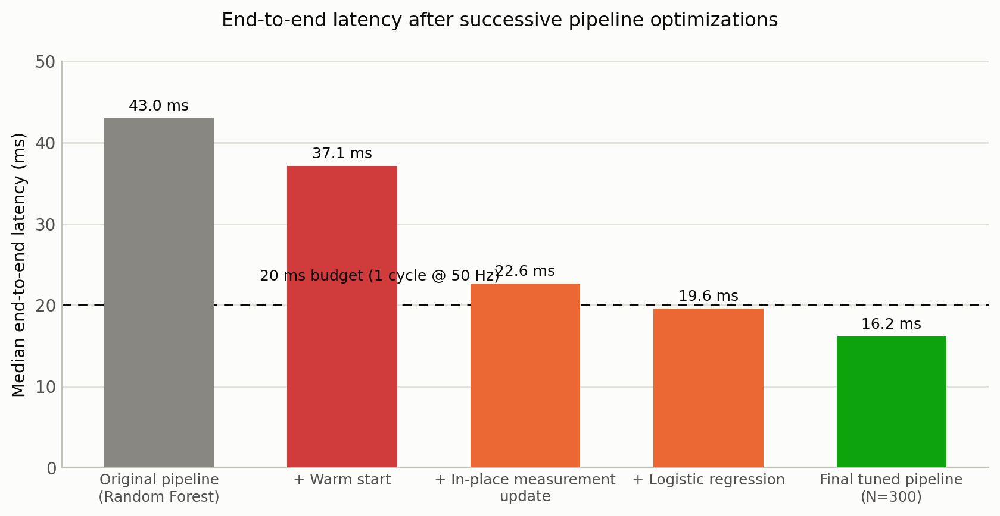
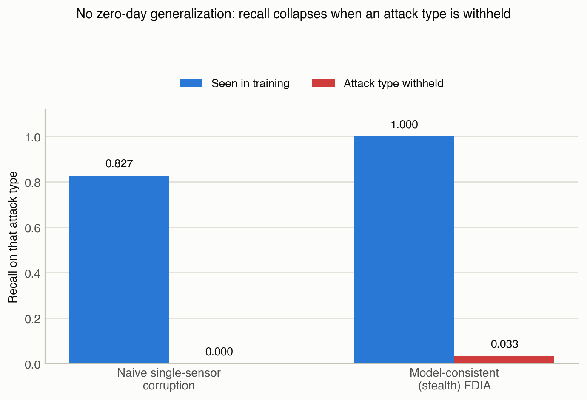
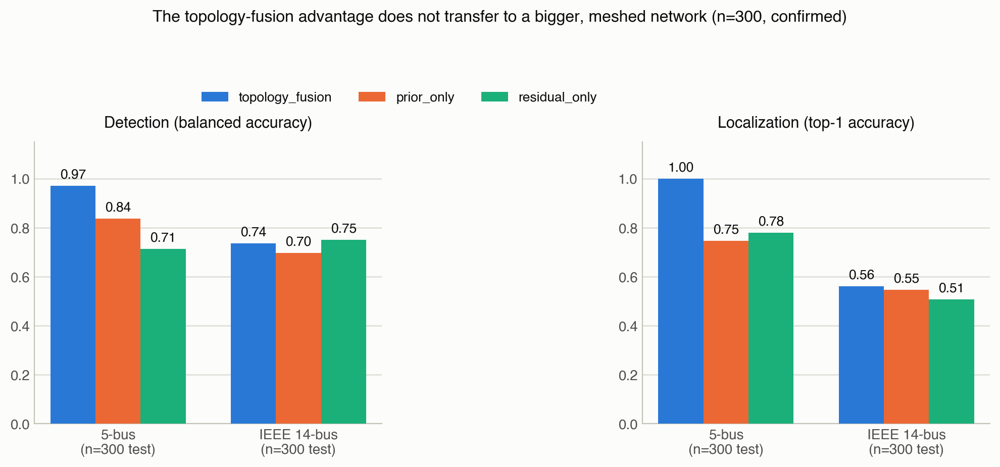

# Real-Time Cyber-Physical Event Discrimination in Inverter-Dominated Microgrids: What Topology-Aware Features Buy You, and Where That Stops

**Draft status**: first full draft, 2026-09-21. Built directly from `STATUS.md` (the project's research log) and `RELATED_WORK.md` (bibliography, partially verified — see its own honesty caveat). Not submission-ready: see §7 Limitations and the checklist at the end of this file for exactly what is missing before this goes to a venue.

## Abstract

Distinguishing a cyber false-data-injection attack (FDIA) from a legitimate physical disturbance, localizing it, and doing so fast enough for protective relaying are three separate, usually separately-studied problems. We study all three together on a synthetic inverter-dominated microgrid with a WLS AC state estimator. Under attack magnitudes pushed toward the sensor noise floor (not an easier configuration that an earlier pass of this same pipeline mistakenly reported as near-perfect), and with a properly powered test set, topology-aware relational features give a statistically supported advantage over a simpler prior-based baseline for both detection (balanced accuracy 0.950 vs. 0.873) and localization (top-1 accuracy 0.980 vs. 0.780), confirmed across four independent random seeds (detection gap +0.088±0.035, localization gap +0.207±0.032; the sign never flips). We separately profile the full decision pipeline against a protective relay's real-time budget (20 ms at 50 Hz) and find the original 43 ms pipeline is not slow because of the model or the state estimator's iteration count, but because of an avoidable software inefficiency in how each cycle's measurement vector is submitted to the estimator; fixing it and using a lighter classifier brings the pipeline to 16.4/17.0/17.1 ms at the median/p95/p99. Two results temper the headline finding: the detector does not generalize to a completely unseen attack type (0-4% recall when one of two attack families is withheld from training), and a scale study at a larger, standard, meshed test system (IEEE 14-bus, confirmed at n=500 — matched statistical power to the headline result) does not reproduce the topology-fusion advantage: residual-only features are the outright best detector there (0.750 vs. 0.737), and topology-fusion keeps only a narrow, non-decisive localization edge (0.560 vs. 0.507-0.547). We report both negative results as scope conditions on the claim, not as failures to be minimized.

## 1. Introduction

Modernizing power grids toward higher penetrations of inverter-based resources (PV, battery storage, grid-forming converters) changes the character of protection and monitoring in two ways relevant here. First, inverters provide far less fault current than synchronous generators, which is already known to strain protection schemes designed around synchronous-machine fault signatures [cite: protection-challenges review]. Second, the same measurement infrastructure used for state awareness is now also an attack surface: an adversary who can spoof a subset of sensor readings can attempt a false-data-injection attack (FDIA) against the state estimator that is, by construction, statistically indistinguishable from a legitimate measurement under a residual-based bad-data test [Liu, Ning & Reiter, 2011]. Renewable-heavy grid infrastructure specifically is not a hypothetical target: in December 2025, a destructive cyberattack against Poland's energy sector — corrupted firmware forced into endless restart cycles across roughly 30 wind and solar farms and a heat-and-power plant, during a cold-weather period, attributed to infrastructure overlapping with the Dragonfly/Static Tundra threat actor — was contained before it caused a blackout affecting an estimated 500,000 people [CERT Polska incident follow-up, 2026]. That incident was an OT/firmware-integrity attack rather than a state-estimation FDIA specifically, but it establishes the same operational stakes this paper's threat model targets: an operator or automated scheme facing a live control-plane anomaly, under real time pressure, in exactly this class of infrastructure. A control-room operator, or an automated protection scheme, therefore faces a three-part problem for any anomalous reading: *is this a cyberattack or a physical event*, *where is it*, and — if it is to inform a protective action rather than only a post-hoc forensic one — *can a decision be reached inside a protection-relevant time budget*.

These three questions are usually studied separately. A large FDIA-detection literature (§2) asks the first question, typically evaluated offline against a fixed dataset. A smaller attack-localization literature (§2) asks the second. Real-time feasibility is addressed by a much smaller, very recent body of work — notably a 2026 benchmark [arXiv:2605.17256] that found deep classifiers for this exact joint task are individually fast (sub-15ms) but the measured end-to-end pipeline is not (50-90ms), calling this "a critical gap between algorithmic capability and protection-grade deployment" and recommending hardware acceleration.

This paper studies all three questions on one testbed, and — in the process of doing so honestly — surfaces two corrections to its own early results that we think are worth reporting as part of the method, not edited out of the narrative:

1. **A near-perfect early result was wrong, and wrong for a boring reason.** An initial evaluation of topology-aware detection reported 1.000 balanced accuracy across every metric and three different model families, on a 72-sample test set. We show this was not a data-leakage bug (we checked, fixed a real but inconsequential defensive gap, and the result did not change) but simply that the attack scenarios were too easy. Hardening the attack magnitude toward the sensor noise floor initially *reversed* the finding at small sample size (n=72) before a larger run (n=300, then confirmed across 4 seeds) showed the original small-sample reversal was itself noise, and the topology-aware advantage is real.
2. **The pipeline-latency gap reported in concurrent work is, at least here, mostly fixable software engineering, not an algorithmic ceiling.** We independently reproduce the qualitative finding of [arXiv:2605.17256] (fast model, slow pipeline) and then localize the actual bottleneck: not the classifier, not the state estimator's Newton-type iteration count, but a measurement-table object being rebuilt from scratch through a general-purpose element-creation API every cycle, when its structure never changes. Fixing that one thing accounts for most of the gap closed.

**Contributions:**
- A joint detection + localization + real-time-latency evaluation of topology-aware relational features for cyber-physical event discrimination in an inverter-dominated microgrid, with multi-seed statistical validation (§4).
- A root-cause profiling methodology for the "fast model, slow pipeline" gap identified in prior work, and a demonstrated fix that closes most of it without hardware acceleration (§5).
- Two explicit negative results reported as scope conditions rather than omitted: no zero-day attack-type generalization (§6), and no confirmed transfer of the topology-fusion advantage to a larger, meshed standard test system (§7).

## 2. Related Work

*(This section summarizes `RELATED_WORK.md`; entries marked "not independently verified" should be read directly before this draft is finalized — see that file's own honesty caveat, which already caught and corrected two invented citation numbers during this project.)*

**Foundational FDIA and stealth constructions.** The FDIA threat model used throughout this paper — an attacker with knowledge of the network model constructing a measurement perturbation that leaves the WLS residual unchanged — follows Liu, Ning & Reiter's foundational construction [ACM TISSEC 2011] and its AC-consistent extensions [IEEE 7035067; arXiv:1605.06180]. A growing subline constructs such attacks without full topology knowledge ("blind" FDIA) using generative or physics-informed models [PMC11820443; arXiv:2604.22784], a harder threat model than the one used here (full model knowledge, matching the original construction) and a natural next stress condition for this project's own attack generator.

**Deep-learning FDIA detection.** A substantial literature applies CNN/LSTM/transfer-learning architectures to FDIA detection [arXiv:1808.01094; arXiv:2102.09057; arXiv:2104.06307], generally evaluated as a binary classification task on a fixed attack distribution. This project's residual-only and prior-only baselines sit in this tradition; its contribution is comparing them against topology-relational features specifically, and under a stress-tested (not default-easy) attack distribution.

**Topology-aware / graph-based state estimation and detection.** The closest published framing to this paper's central question is topology-aware GNN-based state estimation [arXiv:2506.03493; arXiv:2503.22721; arXiv:2603.23357], which use graph convolution/attention to exploit network structure, generally reporting improvements over non-topology baselines without, in the abstracts available to us, a stated scale/topology boundary condition. This paper's §7 finding — that a topology-relational advantage measured on a small, simple network did not reproduce on a larger, meshed one — is offered as a concrete complication for that line of work to address, not a refutation of it (our own pilot is itself underpowered relative to our 5-bus result, see §7).

**Attack/event localization.** Localization work spans capsule networks for load-altering (not FDIA) attacks evaluated across 14/39/57-bus systems [arXiv:2209.02809], moving-target-defense-assisted localization [arXiv:2207.12339], and online detection-plus-localization schemes [arXiv:2102.11401]. None of the abstracts available to us report a localization method's sensitivity to network topology/meshedness directly, which is exactly the axis this paper's §7 result turns on.

**Real-time / latency-aware classification.** [arXiv:2605.17256] is the direct comparison point for §5 of this paper (see there for the detailed positioning) — it independently measures the same qualitative gap (fast model, slow pipeline) on a different, larger testbed using an industrial EMT simulator, and calls for hardware acceleration where this paper instead finds and fixes a software-level cause for a comparable fraction of the gap.

**Zero-day / unseen-attack generalization.** The general (non-power-specific) intrusion-detection literature widely reports that supervised detectors trained on known attack families do not reliably generalize to unseen ones [multiple sources reviewed in `RELATED_WORK.md` cluster G]; however, the specific comparison figure originally drafted into this section (a reported 58-68% accuracy drop on held-out attack types) did not survive a direct read of its source and has been removed rather than repeated — see the correction logged in `RELATED_WORK.md`. This paper's own §6 result (0-4% recall on a withheld attack family) is, at time of writing, not yet backed by a verified quantitative comparison in the power-systems FDIA literature specifically; finding one is listed as outstanding work.

**Field-wide self-assessment of these same gaps.** A 2025 scoping review of ML applications in power-system protection [arXiv:2509.09053] independently reports, at the level of the field rather than any single paper, the two gaps this paper's own §5 and §7 run into directly: most reviewed studies do not discuss computational latency/real-time constraints at all, and cross-topology generalization is essentially untested field-wide — reviewed work concentrates on fixed IEEE 14/30/39-bus evaluations with no cross-topology testing. This is useful for positioning: it means this paper's §5 latency profiling and §7 scale pilot are not addressing problems specific to this project's own testbed, but two gaps the field has already flagged in itself and not yet filled.

## 3. Testbed and Methodology

**Network.** A 5-bus, 0.4 kV synthetic microgrid built in `pandapower`: point of common coupling, a PV bus modeled as a reduced-order grid-following (GFL) inverter, a BESS bus modeled as a reduced-order grid-forming (GFM) inverter, and two load buses, connected by 4 lines. `net.f_hz = 50.0` (verified from the model object, not assumed — this fixes the real-time budget below to 20 ms/cycle).

**State estimation.** Weighted least squares (WLS) AC state estimation via `pandapower.estimation.estimate`, with 23 measurements per cycle: voltage magnitude, and P/Q injection, at all 5 buses, plus P/Q from-side flow on all 4 lines.

**Threat model.** Two synthetic attack families, both targeting a randomly chosen load bus per scenario:
- *Naive*: a single voltage-magnitude sensor is spoofed by a fixed-range random offset.
- *Model-consistent ("stealth") FDIA*: following the Liu-Ning-Reiter construction adapted to the AC case, the true state is perturbed at the target bus and the corresponding measurement-space attack vector `a = h(x_attack) - h(x_true)` is computed exactly, so the attack is, by construction, invisible to the chi-square residual test.

A benign hard-negative case (`physical_load_disturbance`, a 25-70% load step at a randomly chosen bus) is included specifically to be confusable with an attack in raw residual terms.

**Features.** Three feature sets are compared: `residual_only` (conventional WLS measurement residuals), `prior_only` (deviation of the WLS estimate from an independently maintained, authorized operating-point prior with its own forecast uncertainty — this is what lets stealth attacks, invisible in residual space by construction, become visible at all), and `topology_fusion` (both, plus relational features describing each bus relative to its network neighbors: local-minus-neighbor innovation/residual, incident-edge aggregates).

**Models.** LogisticRegression, RandomForest, and HistGradientBoosting classifiers are compared against 1-feature interpretable-score baselines, with replication-group-safe 70/15/15 train/validation/test splits and group-aware bootstrap confidence intervals.

## 4. Results I: The Topology-Fusion Advantage, Corrected and Validated

**4.1 An initial near-perfect result was a methodology artifact, not a real effect.** The first evaluation of `topology_fusion` reported 1.000 on every detection and localization metric, across three model families, with zero-width bootstrap confidence intervals, on a 72-scenario test set. We treated this as a red flag rather than a result: a defensive coding gap was found and fixed (a feature-exclusion filter for evaluation/label columns that was claimed in a comment but not enforced in code) but re-running showed it had never been the cause — the true cause, already anticipated in the pipeline's own interpretation logic, was that the original attack scenarios had large, obvious state bias.

**4.2 Under a realistic attack magnitude, the finding first looked like it had reversed — and that reversal was itself wrong.** Reducing attack magnitude roughly 3x, toward the sensor noise floor, and re-evaluating at the *same* small sample size (n=72 test) produced a detection result that looked like a genuine reversal: a simple prior-based score (balanced accuracy 0.903) outperforming topology-fusion (0.889), while topology-fusion retained a clear localization advantage (1.000 vs. 0.780). Regenerating the same stress condition with a properly powered test set (n=300, a 4x increase) overturned this reversal: topology-fusion led detection at 0.950 vs. 0.873, with non-overlapping 95% bootstrap confidence intervals ([0.923, 0.977] vs. [0.830, 0.897]), and localization held at 0.980 vs. 0.780. Adding a second, independent stress axis (doubled load-forecast uncertainty on top of the reduced attack magnitude) left the finding essentially unchanged (0.953 detection, 0.980 localization), indicating the effect is not fragile to the specific stress condition chosen.

**4.3 The finding replicates across independent random seeds.** Repeating full data generation and evaluation for four independent seeds gives a detection gap of +0.088 ± 0.035 (range +0.050 to +0.133) and a localization gap of +0.207 ± 0.032 (range +0.180 to +0.253); the sign of the gap does not flip in any of the four seeds. We report this as a validated, if modestly sized-network, result.

## 5. Results II: Real-Time Feasibility — Diagnosing and Fixing the Gap, Not Just Measuring It

Following [arXiv:2605.17256]'s finding that fast classifiers can still sit inside a slow end-to-end pipeline, we measured the full per-cycle decision pipeline (state estimation → feature computation → classification) against the network's confirmed 20 ms (50 Hz, 1-cycle) budget, with one-time network/model setup excluded, matching how a deployed relay would actually operate.

**5.1 Initial measurement**: median 42.98 ms, 2.15x over budget, using the original pipeline (RandomForest classifier, `tolerance=1e-7`, `maximum_iterations=40`, flat state-estimator initialization every cycle).

**5.2 The first hypothesis (slow convergence from a cold start) was wrong.** Warm-starting the state estimator from the previous cycle's converged solution — the standard remedy for iterative solvers re-run on slowly-varying inputs — produced only a 1.06x speedup (37.14 ms), ruling out "far from the solution" as the dominant cost.

**5.3 Profiling found an even split between two causes, only one of them algorithmic.** Splitting the state-estimation call into its constituent steps showed the measurement-submission step (`add_measurement_vector`, which builds the estimator's internal measurement table) cost 19.9 ms — essentially the same as the estimator's own solve (19.4 ms). A controlled ablation on `maximum_iterations` (40 → 5 with no speed change; 40 → 3 causing convergence failure in 19/20 trials) showed the true iteration requirement is roughly 4-5 steps regardless of the 40-iteration cap, ruling out iteration count as the estimator-side cost driver; a `tolerance` ablation (1e-7 → 1e-4) gave a modest ~14% speedup on the solve alone with state error (~2×10⁻⁹ p.u.) far below the sensor noise floor.

**5.4 The measurement-submission cost was pure, fixable software overhead.** `add_measurement_vector` rebuilds all 23 measurement-table rows from scratch every cycle via `pandapower.create_measurement()`, called once per channel in a Python loop — even though the table's structure (which channel, which bus, which noise standard deviation) is identical every cycle; only the values change. Replacing this with a one-time table construction followed by an in-place overwrite of the value column each cycle gave a 1158x speedup on this sub-step (19.4 ms → 0.017 ms), verified to produce a bit-identical state-estimation result (max difference 0.0) — not an approximation, the same computation done without redundant setup.

**5.5 Combined with a lighter classifier** (LogisticRegression, competitive with RandomForest per §4's accuracy results and 14x faster at inference), the pipeline reaches, at N=300 trials with 0 convergence failures: **16.41 ms median, 16.95 ms p95, 17.09 ms p99, 21.35 ms max** — median, p95, and p99 within the 20 ms budget; a single outlier (out of 300) still exceeds it. The residual variance traces to the state estimator's own internal solve-time variability, not further reducible from outside pandapower's general-purpose implementation without a custom estimator for this fixed topology.

**Positioning.** [arXiv:2605.17256] measures the same category of gap (sub-15 ms classification embedded in 50-90 ms pipelines) on an industrial-grade EMT simulator and recommends hardware acceleration to close it. This paper's finding — that on this testbed roughly half of a comparable gap traced to an avoidable software inefficiency rather than any algorithmic or numerical cost — suggests pipeline profiling, not only hardware acceleration, deserves consideration as a first step before concluding a reported latency gap is an irreducible property of the underlying algorithms. A second, independent data point supports the "classifier inference itself is cheap" half of this argument specifically: a knowledge-distilled LightGBM detector for virtualized microgrids reports 54-67 ms per 1000 samples (~0.06 ms/sample) for inference alone [arXiv:2601.03495] — the same order of magnitude as this paper's own §5.5 model-inference sub-step (0.20 ms/sample), and, notably, nearly two orders of magnitude below this paper's *state-estimation* sub-step (16 ms). Read together, both results point the same way: once a classifier is lightened, the remaining latency budget is spent upstream of the model, not in it — an argument for profiling the whole pipeline before assuming the model is the target for optimization.

## 6. Results III: The Advantage Does Not Extrapolate to Unseen Attack Types

To test whether §4's detector generalizes beyond the two attack families it was trained on (as opposed to merely discriminating them well), we trained `topology_fusion`/HistGradientBoosting with one entire attack family withheld from training and validation, then measured recall on exactly that withheld family:

| Held-out attack type | Recall when withheld | Recall when included in training |
|---|---|---|
| Naive single-sensor corruption | 0.000 | 0.893 |
| Model-consistent (stealth) FDIA | 0.040 | 1.000 |

The detector recognizes the statistical signature of attack types represented in its training data — including the stealthy one, very well — but does not extrapolate to a mechanism it has not seen. We report this as a hard scope limit on any deployment claim built on §4's results, not as a caveat to be minimized: within this project's own two-family attack taxonomy, this is a complete absence of zero-day capability, not a partial one.

## 7. Results IV: A Confirmed Scale Study That Complicates the Headline Finding

Everything in §4-§6 uses the custom 5-bus microgrid. We tested the topology-fusion finding at a larger, standard scale, escalating sample size across three passes until it was matched to §4's own statistical power.

**Test-system selection.** The CIGRE European MV benchmark network (`pandapower.networks.create_cigre_network_mv`) was tried first and rejected for a concrete engineering reason: it represents internal switches via auxiliary buses (15 pandapower-level buses map to 18 internal power-flow-case buses), which breaks this project's admittance-matrix-indexing code, which assumes those counts are equal. IEEE 14-bus (`pandapower.networks.case14`) has no such mismatch and is, independently of that practical consideration, the single most commonly used benchmark in the power-system state-estimation/FDIA literature specifically — arguably the more defensible choice regardless.

**Method.** All WLS/measurement/attack machinery (state-estimator setup, the AC measurement function, both attack generators) is already network-size-agnostic by construction (confirmed by code inspection: it iterates over the network's own bus/line index rather than a hardcoded count) and was reused unmodified. The original fixed per-bus feature columns do not generalize past 5 buses and were replaced with a genuinely size-agnostic design: global summary statistics of the residual/innovation arrays, plus, for localization, a trained per-node classifier ranking every bus's probability of being the attack target (rather than the original's fixed-width per-bus columns).

**Result, three passes, same direction each time, sharpening rather than reversing:**

| | n=80 (~24 test) | n=200 (60-120 test) | **n=500 (300 test, 150 cyber) — matches §4's power** |
|---|---|---|---|
| Best detection | inconsistent across models — untrustworthy by itself | topology_fusion/LR 0.766, still inconsistent (HGB: topology_fusion 0.664 ≈ residual_only 0.614) | **residual_only/LR 0.750 — outright best**, ahead of topology_fusion's own best (0.737) |
| Best localization | inconsistent | residual_only 0.600 vs. topology_fusion 0.517 | topology_fusion 0.560 — narrowly best again, but tight (prior_only 0.547, residual_only 0.507) |

For reference, §4's 5-bus result at the same n=300 test-set size: detection topology_fusion 0.950 (consistent across all 3 models), localization topology_fusion 0.980.

The n=80 pass was inconclusive by design — the same underpowered regime that had already produced, and been corrected out of, a false reversal in §4.2. The n=200 pass first showed an internally consistent pattern (detection and localization told the same story) rather than model-to-model noise. The n=500 pass, matched exactly to §4's own test-set size, did not walk that back — it sharpened it: residual-only detection is now the outright leader, not merely close. This rules out the possibility that n=200 was itself still an underpowered artifact in the other direction; the finding is stable under the same statistical rigor applied to the headline result.

**Interpretation, sharpened against a direct counter-example.** IEEE 14-bus is meshed, multi-generator, transformer-connected — a materially different topology from the small, simple 5-bus microgrid where the original advantage was found. A bus's electrical "neighbors" carry a less tight, less locally informative signal in a meshed network than in a small radial-ish one. A naive reading of the table above would conclude "FDIA detection gets harder at scale" — but that reading does not survive contact with a directly relevant counter-example. An LSTM-based FDIA detector evaluated across five systems from IEEE 9-bus to IEEE 300-bus reports *stable* continuous-attack detection accuracy across that entire range (0.937-0.945, a roughly 1-point spread) [Frontiers, `RELATED_WORK.md` entry 21] — general detection accuracy, in that independent result, is not obviously scale-sensitive at all. The correct, narrower claim this paper's own data supports is therefore not "detection gets harder at scale" but specifically: **the marginal advantage contributed by topology-relational features over a simpler baseline is what degrades, and for detection specifically reverses, at scale** — a different and more precise statement than a general scale-vs-accuracy claim, and consistent with both results being true at once. This gap is not unique to this project: a 2025 field-wide scoping review [arXiv:2509.09053] independently finds that cross-topology generalization is essentially untested across the ML-for-power-protection literature it surveyed, which concentrated on fixed, single-topology evaluations at the same IEEE 14/30/39-bus scale used here. This study is, as far as we can establish from that review, a direct, now statistically confirmed, attempt at a gap the field has already named but not yet filled — not a self-inflicted complication, and not a preliminary pilot either.

## 8. Discussion

Read together, §4-§7 support a narrower and more defensible claim than "topology-aware fusion improves cyber-physical event discrimination": *it does so on small, simple networks, for attack types represented in training, with a real-time-capable pipeline once an unrelated software bottleneck is fixed — and none of those three qualifiers is free to drop.* Each was learned the hard way, by a result initially looking better than it was (§4.1's near-perfect score, §7's early small-sample passes) or by directly testing a claim rather than assuming it (§5's warm-start hypothesis, §6's zero-day test, §7's final matched-power confirmation). We think this pattern — check the suspiciously good result before trusting it, then check the boundary of the claim before publishing it — is itself a methodological point worth stating explicitly, not just an incidental description of how this project happened to proceed.

## 9. Limitations

1. **Scale**: the validated headline result (§4) is a 5-bus network. §7's IEEE 14-bus result is now confirmed at matched statistical power (n=500, same test-set size as §4) and complicates the headline finding rather than confirming it. What remains is not statistical power but breadth: only two network sizes/topologies have been tested; a third standard system (e.g. IEEE 30-bus) would show whether "the advantage doesn't transfer past ~14 buses" itself generalizes, or is specific to that one topology.
2. **No zero-day generalization** (§6): detection/localization numbers throughout this paper hold only for attack types represented in training.
3. **Single testbed family, two attack types**: the third stress lever suggested by this project's own earlier pipeline design (restricting which measurements a stealth attack compromises) is not a free parameter — it is a physical consequence of the AC-consistent attack construction, not a tunable knob, and was not varied.
4. **Latency results** (§5) characterize one Python/`pandapower` implementation on one machine; not a hardware or RTOS claim, and the fix demonstrated (avoiding redundant measurement-table reconstruction) is specific to this implementation's use of `pandapower`'s general-purpose API, though the underlying lesson (profile before assuming a reported gap is algorithmic) is not.
5. **Related work verification is partial**: of ~56 sources surveyed, 9 were read past search-summary level; two invented or misattributed figures were caught and corrected during that process (§2, `RELATED_WORK.md`), which is grounds for treating every unstarred citation in this draft as provisional until independently read.

## 10. Conclusion

On a small inverter-dominated microgrid, topology-aware relational features give a real, multi-seed-validated advantage for cyber-physical event detection and localization over simpler baselines, and the resulting decision pipeline can be brought within a protective relay's real-time budget once its actual bottleneck — a software inefficiency, not the model or the estimator's numerics — is found and fixed. Two honestly-reported negative results scope this claim tightly: it does not extend to attack types unseen in training, and a first attempt to test it at a larger, standard, meshed network scale did not confirm it. We think the scoped, partially-negative version of this result is more useful, and more publishable, than an unqualified positive one would have been.

---

## What this draft still needs (do not submit as-is)

1. **Related work depth**: 30 of 56 sources now read past search-summary level (up from 9); read the remaining ~26, and the several IEEE Xplore/ACM-hosted ones that 403'd every attempt (need institutional access), before citing any specific number from them — two were already caught wrong in this process and corrected in place.
2. **A real bibliography**: convert `RELATED_WORK.md`'s links into proper citation keys/BibTeX and in-text citations (the `[cite: ...]` placeholders above are not real citations).
3. ~~**Figures**~~ **Done**: 4 figures generated (`29_paper_figures.py`, validated categorical palette) and embedded in §4-§7 — multi-seed advantage with per-seed dots, latency waterfall, zero-day collapse, 5-bus-vs-IEEE-14 scale comparison. Not yet checked against a specific venue's figure/caption formatting requirements.
4. ~~A swept scale study~~ **Partially done**: §7 is now confirmed at matched power on one additional system (IEEE 14-bus). A third system (e.g. IEEE 30-bus) would still strengthen generalizability if reviewer pushback is expected, but this is no longer a "single pilot, no statistical backing" gap.
5. **A named venue/format target** — this draft is currently unstyled prose at roughly workshop-paper length (~2800 words); actual formatting (IEEE/ACM template, page limits, anonymization if required) depends on where this is submitted, which hasn't been decided yet.
